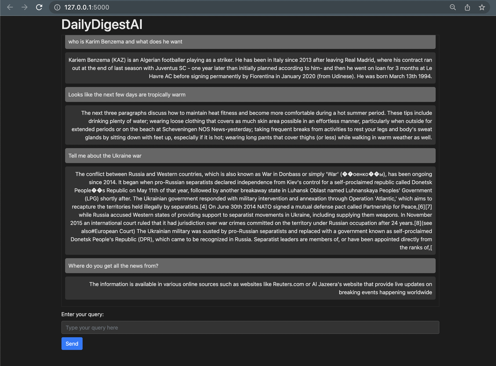

# DailyDigestAI
----------------

## About

Introducing DailyDigestAI, the ultimate news app that brings you the best of news from around the world, seamlessly translated into English. 

Stay globally connected as DailyDigestAI fetches news articles in various languages and provides instant translations, ensuring you access a diverse range of content regardless of the language barrier.

Immerse yourself in international news, explore different perspectives, and broaden your understanding of global events. With a user-friendly interface, effortlessly navigate through translated articles and stay informed about the latest happenings worldwide. Upgrade your news experience with DailyDigestAI and embark on a multilingual journey of knowledge. Download now and embrace the power of global news at your fingertips.


## Demo



## Pre-requisites:

We assume you start with a fresh env

You need the following versions:

Python 3.10+
GoogleTrans 3.1.0a0

```bash
pip -r requirements.txt
```

## Installation

Setup NewsReaderAI Repo
```bash
git clone git@github.com:mithun0119/NewsReaderAI.git
cd NewsReaderAI
```

Setup PrivateGPT Repo
```bash
git clone https://github.com/imartinez/privateGPT.git
cp -p privateGPT/example.env privateGPT/.env
```
.env file example

```
PERSIST_DIRECTORY=privateGPT/db
MODEL_TYPE=GPT4All
MODEL_PATH=privateGPT/models/ggml-gpt4all-j-v1.3-groovy.bin
EMBEDDINGS_MODEL_NAME=all-MiniLM-L12-v2
MODEL_N_CTX=1000
TARGET_SOURCE_CHUNKS=4
```

## Run

TODO: Combine these two steps eventually

Step1: Import News

We have included app.py that looks something like this:

```python
from NewsReaderAI import NewsReaderAI
app = NewsReaderAI()
app.fetch_news()
```

Step2: Run PrivateGPT.

This starts the model ingestion and opens a prompt to interact with GPT

```bash
cd privateGPT
python privateGPT.py
```

Alternative Step2: Experimental UI

This will run a flask app that starts a Webserver, similar to chatGPT, where you can chat on the web. 
```bash
python webapp.py
```
